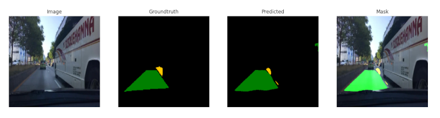
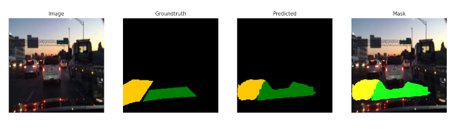
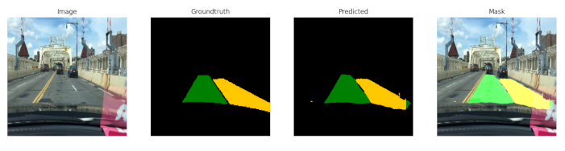

# UNet for Self-driving car.
### Adriano A. Santos, PhD

The U-Net architecture stems from the so-called “fully convolutional network” proposed by Long, Shelhamer, and Darrell in 2014: https://arxiv.org/pdf/1505.04597v1.pdf

## Dataset

 
 Kitti Road dataset: https://www.cvlibs.net/datasets/kitti/

 ## Some results

 

